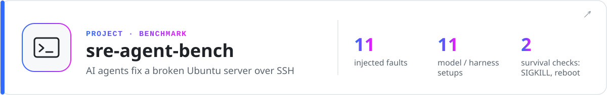
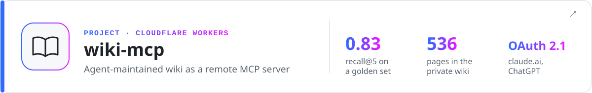

<picture>
  <source media="(prefers-color-scheme: dark)" srcset="assets/header-dark.svg">
  
</picture>

  
  

I build and run a VPN product end to end: the Telegram bot and backend, the Windows and Android apps, a patched proxy core and the servers. I also contribute upstream to the open-source stack it runs on.

<picture>
  <source media="(prefers-color-scheme: dark)" srcset="https://raw.githubusercontent.com/Rerowros/Rerowros/output/stats-dark.svg">
  
</picture>

## Apps I ship

<a href="https://github.com/Rerowros/bpn-android-releases">
<picture>
  <source media="(prefers-color-scheme: dark)" srcset="assets/banner-android-dark.svg">
  
</picture>
</a>

<b>Screenshots, connect speed, releases</b>

 

Connects in one tap, has a separate mode for mobile networks that only let whitelisted sites through, and adds the subscription from Telegram or a QR code by itself. Updates itself from our own server; every APK is signed with one key and its SHA-256 is published with the release. The core is [my mihomo fork](https://github.com/Rerowros/mihomo/tree/bpn/v1.19.32).

  
  
  
  

<picture>
  <source media="(prefers-color-scheme: dark)" srcset="assets/android-connect-dark.svg">
  
</picture>

<a href="https://github.com/Rerowros/bpn-releases">
<picture>
  <source media="(prefers-color-scheme: dark)" srcset="assets/banner-windows-dark.svg">
  
</picture>
</a>

<b>What's inside</b>

 

Desktop client for Windows 10/11. A Tauri UI talks over IPC to a privileged Rust service that runs Mihomo TUN on my core fork. Optional zapret + WinDivert unblock YouTube, Discord and games. On first connect it downloads mihomo, zapret and WinDivert and checks each by hash; after that it updates itself. 25k lines of Rust, 158 tests. Source is private, installers are public.

## Under the hood

<picture>
  <source media="(prefers-color-scheme: dark)" srcset="assets/banner-product-dark.svg">
  
</picture>

<b>How it fits together</b>

 

<picture>
  <source media="(prefers-color-scheme: dark)" srcset="assets/bpn-architecture-dark.svg">
  
</picture>

Traffic is counted on a ledger with rollover, which went live behind shadow validation, a staged rollout and fail-closed gates. Payments are reconciled instead of trusting webhooks, and admin actions go through an outbox so they are idempotent. Restricted mobile networks get front-node → exit routing.

Public pieces: [badvpn-routing](https://github.com/Rerowros/badvpn-routing) (Mihomo rulesets with source-checking CI) and [server-checker](https://github.com/Rerowros/server-checker) (VPS reachability and DPI checks).

<a href="https://github.com/Rerowros/mihomo/tree/bpn/v1.19.32">
<picture>
  <source media="(prefers-color-scheme: dark)" srcset="assets/banner-mihomo-dark.svg">
  
</picture>
</a>

<b>Patches and measurements</b>

 

An upstream [MetaCubeX/mihomo](https://github.com/MetaCubeX/mihomo) tag plus five small patches, rebased onto every new release. Every patch has tests and a written "remove when" condition; the REALITY and XHTTP changes are also checked against a real Xray binary ([BADVPN.md](https://github.com/Rerowros/mihomo/blob/bpn/v1.19.32/BADVPN.md)).

- **P1–P4, REALITY:** current Xray client version, Firefox 148 / Safari 26.3 uTLS fingerprints, opt-in X25519MLKEM768. Without them newer Xray servers drop the client. Upstream declined the version change ([#3132](https://github.com/MetaCubeX/mihomo/issues/3132)) and is waiting for uTLS 1.9.0 ([#3193](https://github.com/MetaCubeX/mihomo/issues/3193)).
- **P5, XHTTP:** packet-up uploads are pipelined like in Xray, up to 8 requests in flight instead of one at a time.

<picture>
  <source media="(prefers-color-scheme: dark)" srcset="assets/mihomo-reality-dark.svg">
  
</picture>

<picture>
  <source media="(prefers-color-scheme: dark)" srcset="assets/mihomo-xhttp-dark.svg">
  
</picture>

## Open source

<a href="https://github.com/Nemu-x/ClashFest">
<picture>
  <source media="(prefers-color-scheme: dark)" srcset="assets/banner-clashfest-dark.svg">
  
</picture>
</a>

<b>What I built there</b>

 

[30 merged PRs](https://github.com/Nemu-x/ClashFest/pulls?q=is%3Apr+author%3ARerowros+is%3Amerged):

- Wi-Fi ↔ LTE failover with consistent DNS and underlying network ([#154](https://github.com/Nemu-x/ClashFest/pull/154))
- comment-preserving mihomo config layer with native Go validation ([#29](https://github.com/Nemu-x/ClashFest/pull/29)) and YAML diff preview ([#13](https://github.com/Nemu-x/ClashFest/pull/13))
- trust-boundary hardening ([#171](https://github.com/Nemu-x/ClashFest/pull/171), [#172](https://github.com/Nemu-x/ClashFest/pull/172)) and APK update verification ([#158](https://github.com/Nemu-x/ClashFest/pull/158))
- Material 3 redesign ([#3](https://github.com/Nemu-x/ClashFest/pull/3))

## Projects

<a href="https://github.com/Rerowros/tg-recall">
<picture>
  <source media="(prefers-color-scheme: dark)" srcset="assets/banner-tg-recall-dark.svg">
  
</picture>
</a>

<b>How it works</b>

 

Syncs allow-listed chats into SQLite FTS5 with hybrid retrieval and local transcription. A hand-rolled MCP server lets AI agents search the archive and answers with `tg://` links back to the source messages. Read-only by design: it cannot send, edit or mark anything read.

<a href="https://github.com/Rerowros/sre-agent-bench">
<picture>
  <source media="(prefers-color-scheme: dark)" srcset="assets/banner-sre-bench-dark.svg">
  
</picture>
</a>

<b>How it works</b>

 

A deliberately broken Ubuntu box (Flask, PostgreSQL, Nginx, systemd) with 11 injected faults: a dead service, wrong credentials, a broken proxy, an exposed database, missing backups, a bad restart policy and more. Every agent action is captured with auditd. An external verifier then checks that the fix survives SIGKILL and a reboot. Results for 11 model/harness configurations.

<a href="https://github.com/Rerowros/wiki-mcp">
<picture>
  <source media="(prefers-color-scheme: dark)" srcset="assets/banner-wiki-mcp-dark.svg">
  
</picture>
</a>

<b>How it works</b>

 

A research wiki on Cloudflare Workers (D1 + KV) that claude.ai and ChatGPT connect to over OAuth 2.1. Agents never write to it directly: changes go through proposal branches that merge only after a schema-lint CI gate. Retrieval quality is tracked on a golden set: recall@5 0.83 on the private 536-page instance.

## Also contributing

<a href="https://github.com/PasarGuard/panel">
<picture>
  <source media="(prefers-color-scheme: dark)" srcset="assets/banner-pasarguard-dark.svg">
  
</picture>
</a>

<b>Pull requests</b>

 

- merged: Mihomo xHTTP subscription options ([panel#509](https://github.com/PasarGuard/panel/pull/509)), UTC-correct API dates ([panel#208](https://github.com/PasarGuard/panel/pull/208)), share-link fix ([panel#880](https://github.com/PasarGuard/panel/pull/880)), WireGuard log timestamps ([node#47](https://github.com/PasarGuard/node/pull/47))
- in review: per-app routing and DNS editor ([panel#759](https://github.com/PasarGuard/panel/pull/759)), confirmed access revocation with node-sync fencing ([panel#756](https://github.com/PasarGuard/panel/pull/756)), node lifecycle hardening ([node#78](https://github.com/PasarGuard/node/pull/78)), atomic node updates with rollback ([scripts#25](https://github.com/PasarGuard/scripts/pull/25))

## Stack

  

<picture>
  <source media="(prefers-color-scheme: dark)" srcset="https://raw.githubusercontent.com/Rerowros/Rerowros/output/snake-dark.svg">
  
</picture>

Every image here is generated from code in [`scripts/`](scripts); the activity card and the snake are re-rendered daily by GitHub Actions.
