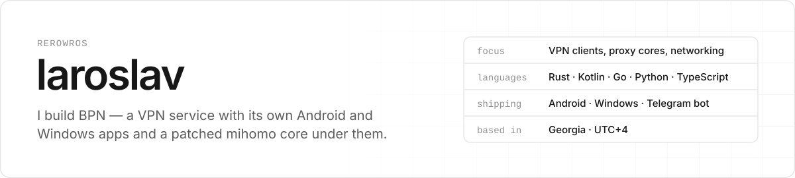
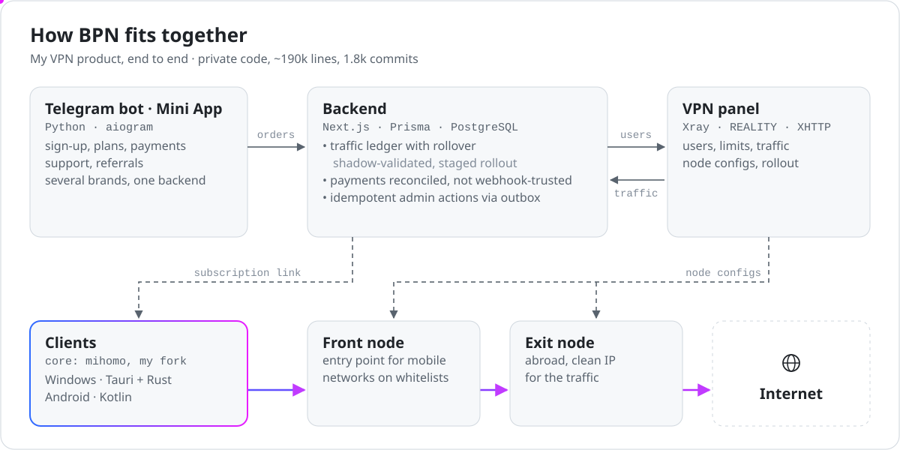
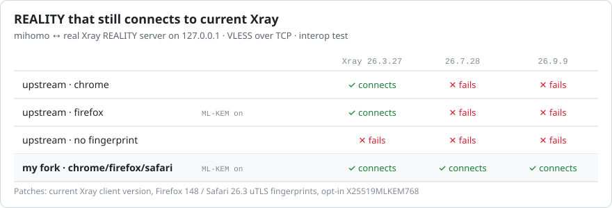
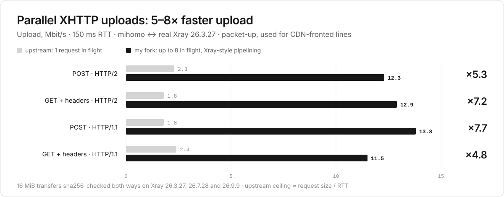

<picture>
  <source media="(prefers-color-scheme: dark)" srcset="assets/header-dark.svg">
  
</picture>

  
  

I build and run a VPN product end to end: the Telegram bot and backend, the Windows and Android apps, a patched proxy core and the servers. I also contribute upstream to the open-source stack it runs on.

## Apps I ship

### BadVPN for Android &nbsp;

VPN client for Android 6+ on [my mihomo fork](#mihomo-fork). Connects in one tap, has a separate mode for mobile networks that only let whitelisted sites through, and adds the subscription from Telegram or a QR code by itself. Updates itself from our own server. Every APK is signed with one key, and its SHA-256 is published with the release. → [**bpn-android-releases**](https://github.com/Rerowros/bpn-android-releases)

  
  
  
  

### BPN for Windows &nbsp;

Desktop client for Windows 10/11: a Tauri UI and a privileged Rust service talking over IPC, Mihomo TUN on my core fork, optional zapret + WinDivert to unblock YouTube, Discord and games. Downloads its components and checks them by hash, then updates itself. 25k lines of Rust, 158 tests. → [**bpn-releases**](https://github.com/Rerowros/bpn-releases)

### Behind them

<picture>
  <source media="(prefers-color-scheme: dark)" srcset="assets/bpn-architecture-dark.svg">
  
</picture>

The product itself is private: ~190k lines, 1.8k commits, 160+ test files. Traffic is counted on a ledger with rollover, which went live behind shadow validation, a staged rollout and fail-closed gates. Payments are reconciled instead of trusting webhooks, and admin actions go through an outbox so they are idempotent. Restricted mobile networks get front-node → exit routing. Public pieces: [badvpn-routing](https://github.com/Rerowros/badvpn-routing) (Mihomo rulesets with source-checking CI) and [server-checker](https://github.com/Rerowros/server-checker) (VPS reachability and DPI checks).

## mihomo fork

[**Rerowros/mihomo**](https://github.com/Rerowros/mihomo/tree/bpn/v1.19.32) is the proxy core inside both apps: an upstream [MetaCubeX/mihomo](https://github.com/MetaCubeX/mihomo) tag plus five small patches, rebased onto every new release. Every patch has tests and a written "remove when" condition; the REALITY and XHTTP changes are also checked against a real Xray binary ([BADVPN.md](https://github.com/Rerowros/mihomo/blob/bpn/v1.19.32/BADVPN.md)).

- **P1–P4, REALITY:** current Xray client version, Firefox 148 / Safari 26.3 uTLS fingerprints, opt-in X25519MLKEM768. Without them newer Xray servers drop the client. Upstream declined the version change ([#3132](https://github.com/MetaCubeX/mihomo/issues/3132)) and is waiting for uTLS 1.9.0 ([#3193](https://github.com/MetaCubeX/mihomo/issues/3193)).
- **P5, XHTTP:** packet-up uploads are pipelined like in Xray, up to 8 requests in flight instead of one at a time.

<picture>
  <source media="(prefers-color-scheme: dark)" srcset="assets/mihomo-reality-dark.svg">
  
</picture>

<picture>
  <source media="(prefers-color-scheme: dark)" srcset="assets/mihomo-xhttp-dark.svg">
  
</picture>

## Open source

**[Nemu-x/ClashFest](https://github.com/Nemu-x/ClashFest)** · Android client on mihomo · 222★ — core contributor: [30 merged PRs](https://github.com/Nemu-x/ClashFest/pulls?q=is%3Apr+author%3ARerowros+is%3Amerged), +19.6k lines, ~15% of the current codebase.
- Wi-Fi ↔ LTE failover with consistent DNS and underlying network ([#154](https://github.com/Nemu-x/ClashFest/pull/154))
- comment-preserving mihomo config layer with native Go validation ([#29](https://github.com/Nemu-x/ClashFest/pull/29)) and YAML diff preview ([#13](https://github.com/Nemu-x/ClashFest/pull/13))
- trust-boundary hardening ([#171](https://github.com/Nemu-x/ClashFest/pull/171), [#172](https://github.com/Nemu-x/ClashFest/pull/172)) and APK update verification ([#158](https://github.com/Nemu-x/ClashFest/pull/158))
- Material 3 redesign ([#3](https://github.com/Nemu-x/ClashFest/pull/3))

## Projects

| | |
|---|---|
| **[tg-recall](https://github.com/Rerowros/tg-recall)** | Local-first Telegram archive for people and AI agents. Syncs allow-listed chats into SQLite FTS5, hybrid retrieval, local transcription, a hand-rolled MCP server that answers with `tg://` source links. Python, 15k lines, 300+ tests, CI on Windows and Linux. |
| **[sre-agent-bench](https://github.com/Rerowros/sre-agent-bench)** | Benchmark of AI coding agents repairing a deliberately broken Ubuntu server over SSH: 11 injected faults, auditd action capture, an external verifier that checks the fix survives SIGKILL and reboot. Results for 11 model/harness setups. |
| **[wiki-mcp](https://github.com/Rerowros/wiki-mcp)** | Agent-maintained research wiki as a remote MCP server on Cloudflare Workers: OAuth 2.1 for claude.ai/ChatGPT, D1 + KV, writes go through proposal branches that merge only after a schema-lint CI gate. Retrieval tracked on a golden set (recall@5 0.83 on a 536-page wiki). |
| **[lumacalc](https://github.com/Rerowros/lumacalc)** | Native Windows calculator in Rust + Slint: pure engine crate with `unsafe` forbidden, thin Win32 layer, clippy pedantic, per-user install. |
| **[Remoji-tg-mcp](https://github.com/Rerowros/Remoji-tg-mcp)** | MCP server for finding Telegram custom emoji and stickers, [on PyPI](https://pypi.org/project/remoji-tg-mcp/). |
| **[yookassa-telegram](https://github.com/Rerowros/yookassa_telegram)** | YooKassa payments for aiogram 3: fiscal receipts, webhooks, refunds, [on PyPI](https://pypi.org/project/yookassa-telegram/). |

## Also contributing

**[PasarGuard](https://github.com/PasarGuard/panel)** · VPN panel + node · 2.6k★
- merged: Mihomo xHTTP subscription options ([panel#509](https://github.com/PasarGuard/panel/pull/509)), UTC-correct API dates ([panel#208](https://github.com/PasarGuard/panel/pull/208)), share-link fix ([panel#880](https://github.com/PasarGuard/panel/pull/880)), WireGuard log timestamps ([node#47](https://github.com/PasarGuard/node/pull/47))
- in review: per-app routing and DNS editor ([panel#759](https://github.com/PasarGuard/panel/pull/759)), confirmed access revocation with node-sync fencing ([panel#756](https://github.com/PasarGuard/panel/pull/756)), node lifecycle hardening ([node#78](https://github.com/PasarGuard/node/pull/78)), atomic node updates with rollback ([scripts#25](https://github.com/PasarGuard/scripts/pull/25))

## Stack

  

Python · TypeScript · Rust · Kotlin · Go — Next.js, FastAPI, aiogram, Tauri, Android, mihomo/Xray, PostgreSQL, Cloudflare Workers.
