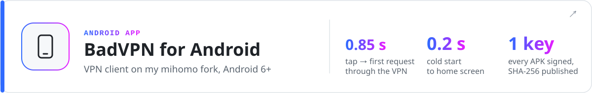
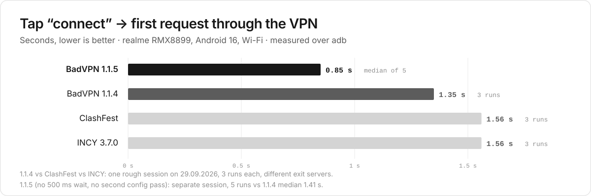
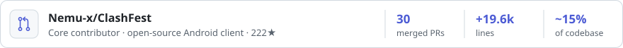
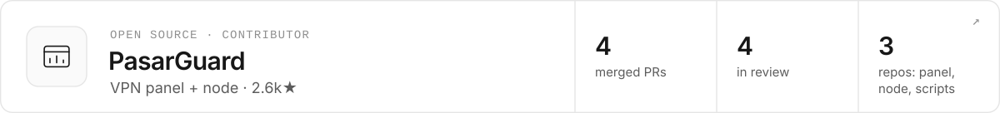

<picture>
  <source media="(prefers-color-scheme: dark)" srcset="assets/header-dark.svg">
  
</picture>

  
  

I write production software end to end: an Android app, a Windows app with a privileged Rust service, the backend and servers behind them, and the network core both apps share. In open source I'm a core contributor to ClashFest; on the side I build tools for AI agents.

<picture>
  <source media="(prefers-color-scheme: dark)" srcset="https://raw.githubusercontent.com/Rerowros/Rerowros/output/stats-dark.svg">
  
</picture>

## Apps

<a href="https://github.com/Rerowros/bpn-android-releases">
<picture>
  <source media="(prefers-color-scheme: dark)" srcset="assets/banner-android-dark.svg">
  
</picture>
</a>

<b>Screenshots · connect-time benchmark vs ClashFest and INCY</b>

 

A fork of [ClashFest](https://github.com/Nemu-x/ClashFest), where I'm a core contributor, running on [my mihomo fork](https://github.com/Rerowros/mihomo/tree/bpn/v1.19.32). One tap to connect, a separate mode for mobile networks that only allow whitelisted sites, and subscription import from Telegram or a QR code. Updates come from our own server; every APK is signed with the same key and its SHA-256 is published with the release.

  
  
  
  

<picture>
  <source media="(prefers-color-scheme: dark)" srcset="assets/android-connect-dark.svg">
  
</picture>

The 1.1.5 speed-up came from two changes: no fixed 500 ms wait before the first config load, and no second pass over a config that was already validated.

<a href="https://github.com/Rerowros/bpn-releases">
<picture>
  <source media="(prefers-color-scheme: dark)" srcset="assets/banner-windows-dark.svg">
  
</picture>
</a>

<b>How it's built</b>

 

Windows 10/11. The Tauri UI runs unprivileged and talks over IPC to a Rust service that owns the TUN interface and runs Mihomo on [my core fork](https://github.com/Rerowros/mihomo/tree/bpn/v1.19.32). Optional zapret + WinDivert for YouTube, Discord and games. Third-party binaries (mihomo, zapret, WinDivert) are downloaded on first connect and checked by hash, and the app updates itself. 25k lines of Rust, 158 tests. The source is private; installers are public.

## Under the hood

<a href="https://github.com/Rerowros/mihomo/tree/bpn/v1.19.32">
<picture>
  <source media="(prefers-color-scheme: dark)" srcset="assets/banner-mihomo-dark.svg">
  
</picture>
</a>

<b>The 5 patches · REALITY matrix · XHTTP benchmark</b>

 

The network core both apps run on: an upstream [MetaCubeX/mihomo](https://github.com/MetaCubeX/mihomo) tag plus five small patches, moved to each new release by rebase. Every patch has tests and a written "remove when" condition; the REALITY and XHTTP changes are also tested against a real Xray binary ([BADVPN.md](https://github.com/Rerowros/mihomo/blob/bpn/v1.19.32/BADVPN.md)).

- **P1–P4, REALITY:** current Xray client version, Firefox 148 / Safari 26.3 uTLS fingerprints, opt-in X25519MLKEM768. Without them current Xray servers reject the client. Upstream declined the version change ([#3132](https://github.com/MetaCubeX/mihomo/issues/3132)) and is waiting for uTLS 1.9.0 ([#3193](https://github.com/MetaCubeX/mihomo/issues/3193)).
- **P5, XHTTP:** uploads in packet-up mode are pipelined the way Xray does it, up to 8 requests in flight instead of one.

<picture>
  <source media="(prefers-color-scheme: dark)" srcset="assets/mihomo-reality-dark.svg">
  
</picture>

<picture>
  <source media="(prefers-color-scheme: dark)" srcset="assets/mihomo-xhttp-dark.svg">
  
</picture>

<picture>
  <source media="(prefers-color-scheme: dark)" srcset="assets/banner-product-dark.svg">
  
</picture>

<b>Architecture diagram · what's interesting in the backend</b>

 

<picture>
  <source media="(prefers-color-scheme: dark)" srcset="assets/bpn-architecture-dark.svg">
  
</picture>

The service behind both apps: a Next.js + Prisma/PostgreSQL backend, a Python Telegram bot with a Mini App, a VPN panel and the nodes. Several brands run on the same backend.

- Traffic is counted on a ledger with rollover. It went live behind shadow validation, a staged rollout and fail-closed gates.
- Payments are reconciled, not taken on trust from webhooks.
- Admin actions go through an outbox, so a retry never applies twice.
- Mobile networks that only allow whitelisted destinations get front-node → exit routing.

Public pieces: [badvpn-routing](https://github.com/Rerowros/badvpn-routing) (Mihomo rulesets with source-checking CI) and [server-checker](https://github.com/Rerowros/server-checker) (VPS reachability and DPI checks).

## Open source

<a href="https://github.com/Nemu-x/ClashFest">
<picture>
  <source media="(prefers-color-scheme: dark)" srcset="assets/banner-clashfest-dark.svg">
  
</picture>
</a>

<b>Highlights from 30 merged PRs</b>

 

Open-source Android client on mihomo and the base of my own Android app. [30 merged PRs](https://github.com/Nemu-x/ClashFest/pulls?q=is%3Apr+author%3ARerowros+is%3Amerged), +19.6k lines, about 15% of today's codebase:

- Wi-Fi ↔ LTE failover that keeps DNS and the underlying network consistent ([#154](https://github.com/Nemu-x/ClashFest/pull/154))
- a mihomo config layer that preserves comments, with native Go validation ([#29](https://github.com/Nemu-x/ClashFest/pull/29)) and a YAML diff preview ([#13](https://github.com/Nemu-x/ClashFest/pull/13))
- trust-boundary hardening ([#171](https://github.com/Nemu-x/ClashFest/pull/171), [#172](https://github.com/Nemu-x/ClashFest/pull/172)) and APK update verification ([#158](https://github.com/Nemu-x/ClashFest/pull/158))
- the Material 3 redesign ([#3](https://github.com/Nemu-x/ClashFest/pull/3))

<a href="https://github.com/PasarGuard/panel">
<picture>
  <source media="(prefers-color-scheme: dark)" srcset="assets/banner-pasarguard-dark.svg">
  
</picture>
</a>

<b>4 merged, 4 in review</b>

 

Open-source VPN panel and node.

- merged: Mihomo xHTTP subscription options ([panel#509](https://github.com/PasarGuard/panel/pull/509)), UTC-correct API dates ([panel#208](https://github.com/PasarGuard/panel/pull/208)), share-link fix ([panel#880](https://github.com/PasarGuard/panel/pull/880)), WireGuard log timestamps ([node#47](https://github.com/PasarGuard/node/pull/47))
- in review: per-app routing and DNS editor ([panel#759](https://github.com/PasarGuard/panel/pull/759)), confirmed access revocation with node-sync fencing ([panel#756](https://github.com/PasarGuard/panel/pull/756)), node lifecycle hardening ([node#78](https://github.com/PasarGuard/node/pull/78)), atomic node updates with rollback ([scripts#25](https://github.com/PasarGuard/scripts/pull/25))

## Projects

<a href="https://github.com/Rerowros/tg-recall">
<picture>
  <source media="(prefers-color-scheme: dark)" srcset="assets/banner-tg-recall-dark.svg">
  
</picture>
</a>

<b>How it works</b>

 

Syncs allow-listed chats into SQLite FTS5, with hybrid retrieval and local transcription. A hand-rolled MCP server lets AI agents search the archive and answers with `tg://` links back to the source messages. Read-only by design: it cannot send, edit or mark anything as read.

- [**sre-agent-bench**](https://github.com/Rerowros/sre-agent-bench) — AI agents repair a deliberately broken Ubuntu server over SSH; an external verifier checks that the fix survives SIGKILL and a reboot.
- [**wiki-mcp**](https://github.com/Rerowros/wiki-mcp) — a research wiki that agents maintain through reviewed proposal branches, served as a remote MCP server on Cloudflare Workers.

Every image here is generated from code in [`scripts/`](scripts); the activity card is re-rendered daily by GitHub Actions.
