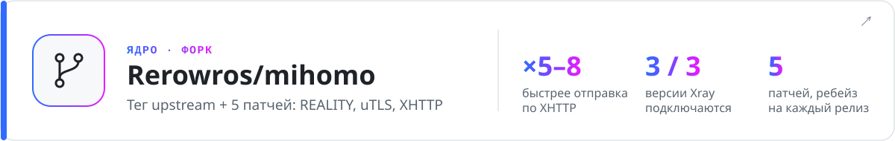
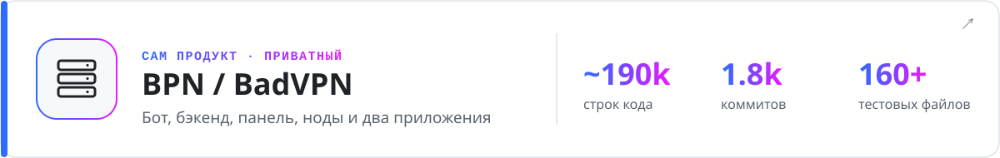
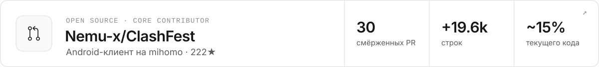
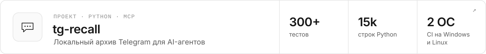

<picture>
  <source media="(prefers-color-scheme: dark)" srcset="../assets/header-dark.svg">
  
</picture>

  
  

Пишу продакшен-софт целиком: Android-приложение, Windows-приложение с привилегированным сервисом на Rust, бэкенд и серверы за ними и общее для обоих приложений сетевое ядро. В open source — core contributor ClashFest, в свободное время делаю инструменты для AI-агентов.

<picture>
  <source media="(prefers-color-scheme: dark)" srcset="https://raw.githubusercontent.com/Rerowros/Rerowros/output/stats-dark.svg">
  
</picture>

## Приложения

<a href="https://github.com/Rerowros/bpn-android-releases">
<picture>
  <source media="(prefers-color-scheme: dark)" srcset="../assets/banner-android-ru-dark.svg">
  
</picture>
</a>

<b>Скриншоты · замер подключения против ClashFest и INCY</b>

 

Форк [ClashFest](https://github.com/Nemu-x/ClashFest), где я core contributor, на [моём форке mihomo](https://github.com/Rerowros/mihomo/tree/bpn/v1.19.32). Подключение в одно нажатие, отдельный режим для мобильного интернета на белых списках, подписка из Telegram или по QR-коду. Обновления приходят с нашего сервера; все APK подписаны одним ключом, SHA-256 публикуется в релизе.

  
  
  
  

<picture>
  <source media="(prefers-color-scheme: dark)" srcset="../assets/android-connect-dark.svg">
  
</picture>

Ускорение в 1.1.5 дали две правки: убрано фиксированное ожидание 500 мс перед первой загрузкой конфига и повторная обработка уже проверенного конфига.

<a href="https://github.com/Rerowros/bpn-releases">
<picture>
  <source media="(prefers-color-scheme: dark)" srcset="../assets/banner-windows-ru-dark.svg">
  
</picture>
</a>

<b>Как устроено</b>

 

Windows 10/11. Интерфейс на Tauri работает без прав и через IPC управляет сервисом на Rust, который держит TUN и запускает Mihomo на [моём форке ядра](https://github.com/Rerowros/mihomo/tree/bpn/v1.19.32). Опционально zapret + WinDivert для YouTube, Discord и игр. Сторонние бинарники (mihomo, zapret, WinDivert) скачиваются при первом подключении и сверяются по хешу, приложение обновляется само. 25k строк Rust, 158 тестов. Код приватный, установщики публичные.

## Под капотом

<a href="https://github.com/Rerowros/mihomo/tree/bpn/v1.19.32">
<picture>
  <source media="(prefers-color-scheme: dark)" srcset="../assets/banner-mihomo-ru-dark.svg">
  
</picture>
</a>

<b>5 патчей · матрица REALITY · замер XHTTP</b>

 

Сетевое ядро обоих приложений: тег upstream [MetaCubeX/mihomo](https://github.com/MetaCubeX/mihomo) плюс пять небольших патчей, которые переносятся ребейзом на каждый новый релиз. У каждого патча есть тесты и записанное условие «когда убрать»; правки REALITY и XHTTP дополнительно проверяются против настоящего бинаря Xray ([BADVPN.md](https://github.com/Rerowros/mihomo/blob/bpn/v1.19.32/BADVPN.md)).

- **P1–P4, REALITY:** актуальная версия клиента Xray, отпечатки uTLS Firefox 148 / Safari 26.3, X25519MLKEM768 по опции. Без них свежие серверы Xray не пускают клиента. Upstream отказался менять версию ([#3132](https://github.com/MetaCubeX/mihomo/issues/3132)) и ждёт uTLS 1.9.0 ([#3193](https://github.com/MetaCubeX/mihomo/issues/3193)).
- **P5, XHTTP:** отправка в режиме packet-up идёт конвейером, как в Xray: до 8 запросов одновременно вместо одного.

<picture>
  <source media="(prefers-color-scheme: dark)" srcset="../assets/mihomo-reality-dark.svg">
  
</picture>

<picture>
  <source media="(prefers-color-scheme: dark)" srcset="../assets/mihomo-xhttp-dark.svg">
  
</picture>

<picture>
  <source media="(prefers-color-scheme: dark)" srcset="../assets/banner-product-ru-dark.svg">
  
</picture>

<b>Схема · что интересного в бэкенде</b>

 

<picture>
  <source media="(prefers-color-scheme: dark)" srcset="../assets/bpn-architecture-dark.svg">
  
</picture>

Сервис за обоими приложениями: бэкенд на Next.js + Prisma/PostgreSQL, Telegram-бот на Python с Mini App, VPN-панель и ноды. На одном бэкенде работают несколько брендов.

- Трафик считается на леджере с переносом остатка. Включали через shadow-валидацию, выкатку волнами и fail-closed гейты.
- Платежи сверяются, а не принимаются на веру по вебхукам.
- Админ-действия идут через outbox, поэтому повтор никогда не применится дважды.
- Для мобильных сетей, где открыты только сайты из белого списка, — маршрут front-нода → exit.

Публичные части: [badvpn-routing](https://github.com/Rerowros/badvpn-routing) (правила Mihomo с CI-проверкой источников) и [server-checker](https://github.com/Rerowros/server-checker) (проверка доступности VPS и DPI).

## Open source

<a href="https://github.com/Nemu-x/ClashFest">
<picture>
  <source media="(prefers-color-scheme: dark)" srcset="../assets/banner-clashfest-ru-dark.svg">
  
</picture>
</a>

<b>Главное из 30 смёрженных PR</b>

 

Open-source Android-клиент на mihomo и основа моего Android-приложения. [30 смёрженных PR](https://github.com/Nemu-x/ClashFest/pulls?q=is%3Apr+author%3ARerowros+is%3Amerged), +19.6k строк, около 15% текущего кода:

- переключение Wi-Fi ↔ LTE с согласованными DNS и underlying network ([#154](https://github.com/Nemu-x/ClashFest/pull/154))
- слой конфига mihomo, который сохраняет комментарии, с валидацией через Go ([#29](https://github.com/Nemu-x/ClashFest/pull/29)) и превью YAML-диффа ([#13](https://github.com/Nemu-x/ClashFest/pull/13))
- усиление границ доверия ([#171](https://github.com/Nemu-x/ClashFest/pull/171), [#172](https://github.com/Nemu-x/ClashFest/pull/172)) и проверка APK-обновлений ([#158](https://github.com/Nemu-x/ClashFest/pull/158))
- редизайн на Material 3 ([#3](https://github.com/Nemu-x/ClashFest/pull/3))

<a href="https://github.com/PasarGuard/panel">
<picture>
  <source media="(prefers-color-scheme: dark)" srcset="../assets/banner-pasarguard-ru-dark.svg">
  
</picture>
</a>

<b>4 смёржено, 4 на ревью</b>

 

Open-source VPN-панель и нода.

- смёржено: xHTTP-опции в подписках Mihomo ([panel#509](https://github.com/PasarGuard/panel/pull/509)), даты API в UTC ([panel#208](https://github.com/PasarGuard/panel/pull/208)), share-link ([panel#880](https://github.com/PasarGuard/panel/pull/880)), время в логах WireGuard ([node#47](https://github.com/PasarGuard/node/pull/47))
- на ревью: редактор маршрутизации и DNS по приложениям ([panel#759](https://github.com/PasarGuard/panel/pull/759)), подтверждаемый отзыв доступа с fencing синхронизации нод ([panel#756](https://github.com/PasarGuard/panel/pull/756)), жизненный цикл ноды ([node#78](https://github.com/PasarGuard/node/pull/78)), атомарное обновление ноды с откатом ([scripts#25](https://github.com/PasarGuard/scripts/pull/25))

## Проекты

<a href="https://github.com/Rerowros/tg-recall">
<picture>
  <source media="(prefers-color-scheme: dark)" srcset="../assets/banner-tg-recall-ru-dark.svg">
  
</picture>
</a>

<b>Как устроено</b>

 

Синхронизирует разрешённые чаты в SQLite FTS5, гибридный поиск, локальная транскрипция. Свой MCP-сервер даёт AI-агентам искать по архиву и отвечает ссылками `tg://` на исходные сообщения. Только чтение: ничего не отправляет, не редактирует и не помечает прочитанным.

- [**sre-agent-bench**](https://github.com/Rerowros/sre-agent-bench) — AI-агенты по SSH чинят специально сломанный Ubuntu-сервер; внешний верификатор проверяет, что починка переживает SIGKILL и перезагрузку.
- [**wiki-mcp**](https://github.com/Rerowros/wiki-mcp) — исследовательская вики, которую агенты ведут через proposal-ветки с проверкой, как удалённый MCP-сервер на Cloudflare Workers.

Все картинки здесь генерируются кодом из [`scripts/`](../scripts); карточка активности перерисовывается каждый день через GitHub Actions.
